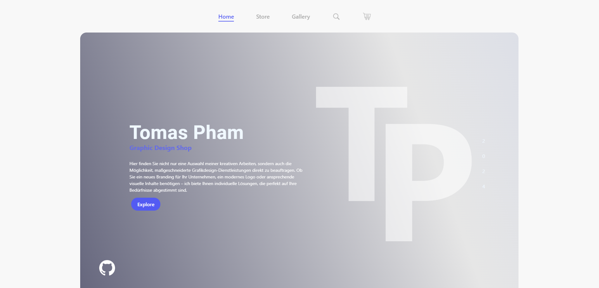
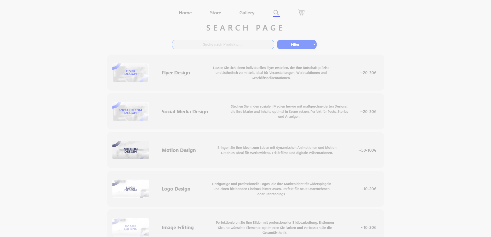
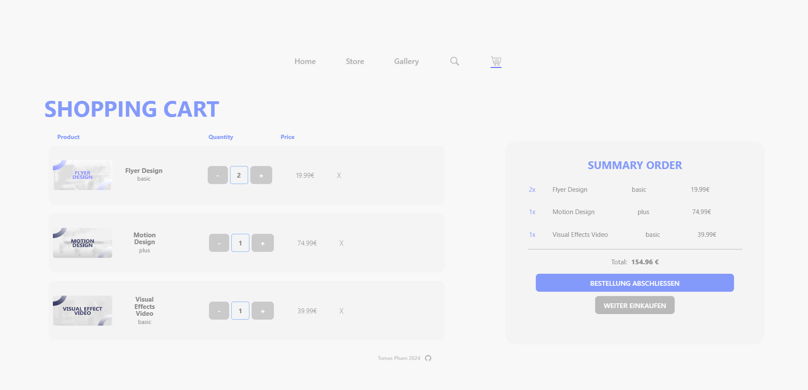

# Online-Shop-React

## Live-preview: https://online-shop-react-tomas.vercel.app/

---

### Screenshots

#### Startseite







---

## Inhaltsverzeichnis

1. [Projektübersicht](#projektübersicht)
2. [Verwendete Sprachen/Tools](#verwendete-sprachen-tools)
3. [Verzeichnisstruktur](#verzeichnisstruktur)
4. [Funktionalitäten](#funktionalitäten)
5. [Installation](#installation)

---

## 1. Projektübersicht

**Online-Shop-React** ist eine React-basierte Webanwendung, die als Beispiel eines Online-Shops dient. Der Shop ermöglicht es Nutzern, Produkte anzusehen, nach bestimmten Begriffen/Optionen in der Suchleiste zu filtern, in den Warenkorb zu legen und eine Bestellung durchzuführen.

Das Projekt dient als Lernressource und Vorlage für die Entwicklung eines Online-E-Commerce-Shops.

## 2. Verwendete Sprachen/Tools

- **React**: Bibliothek zur Erstellung der Benutzeroberfläche.
- **Vite**: Modernes Build-Tool, das für schnelle Entwicklungs- und Build-Prozesse sorgt und optimierte Bundles erstellt.
- **JavaScript**: Programmiersprache zur Implementierung der Logik.
- **CSS**: Styling für die Benutzeroberfläche und das Layout.
- **CSS Modules**: Eine Methode zum Styling von React-Komponenten, die lokal geltende CSS-Klassen bietet und somit Namenskonflikte vermeidet.
- **Embla Carousel**: Ein flexibles und leistungsstarkes Karussell-Modul, das für die Erstellung von Slidern und Bildkarussellen verwendet wird.
- **Framer Motion**: Eine Bibliothek zur Implementierung von Animationen und Übergängen in React-Anwendungen, die für flüssige und reaktionsschnelle Animationen sorgt.
- **React Router**: Eine Routing-Bibliothek für React, die es ermöglicht, zwischen verschiedenen Seiten und Komponenten der Anwendung zu navigieren.

## 3. Verzeichnisstruktur

```bash
Online-Shop-React/
│
├── public/
│   └── assets/
│       ├── productImg/
│       ├── productImg2/
│       │   ├── Flyer/
│       │   ├── Logo/
│       │   ├── photos/
│       │   └── SM/
│
├── src/
│   ├── assets/
│   │   ├── andereBilder/
│   │   ├── DeutschBilder/
│   │   ├── Polis/
│   │   └── Präsentationen/
│   ├── components/
│   │   ├── imageCarousel/
│   │   ├── searchBar/
│   │   └── Watermark/
│   ├── data/
│   ├── pages/
│   ├── routes/
│   └── styles/
│
└──
```

## 4. Funktionalitäten

Der Online-Shop bietet die folgenden Funktionen:

1. **Store-Seite: Produkte anzeigen**  
   Benutzer können eine Liste der verfügbaren Produkte durchstöbern und detaillierte Informationen zu jedem Produkt auf einer separaten Seite einsehen.

2. **Suchseite: Produktfilter und -suche**  
   Produkte können nach Kategorien gefiltert und gezielt gesucht werden. Eine Suchfunktion zur Produktfindung ist ebenfalls implementiert.

3. **Galerie**  
   In der Galerie können Nutzer zwischen zwei Kategorien wählen: Grafikdesign und Motion Design. Grafikdesign umfasst statische Designs wie Flyer oder Präsentationen, während Motion Design Animationen wie Erklärvideos oder Werbespots beinhaltet. Über die Galerie-Seite ist auch eine Weiterleitung zur Store-Seite möglich.

4. **Produktseite: Produkte in den Warenkorb legen**  
   Nutzer haben die Möglichkeit, Produkte in den Warenkorb zu legen und die gewünschte Menge anzupassen. Vor dem Hinzufügen zum Warenkorb muss der Nutzer zwischen drei Produktoptionen wählen: Basic, Plus und Premium.

5. **Warenkorb-Seite: Verwaltung des Warenkorbs**  
   Der Warenkorb bietet eine Übersicht der ausgewählten Produkte inklusive Preis, Menge und Gesamtpreis. Nutzer können die Menge der Produkte ändern oder Artikel aus dem Warenkorb entfernen.

## 5. Installation

### Schritte zur Installation

1. **Klonen des Repositories:**

   ```bash
   git clone https://github.com/tomasjpn/Online-Shop-React.git
   ```

2. **Wechseln in das Projektverzeichnis:**

   ```bash
   cd Online-Shop-React
   ```

3. **Installieren der Abhängigkeiten:**

   ```bash
   npm install
   ```

4. **Starten der Anwendung:**

   ```bash
   npm run dev
   ```
